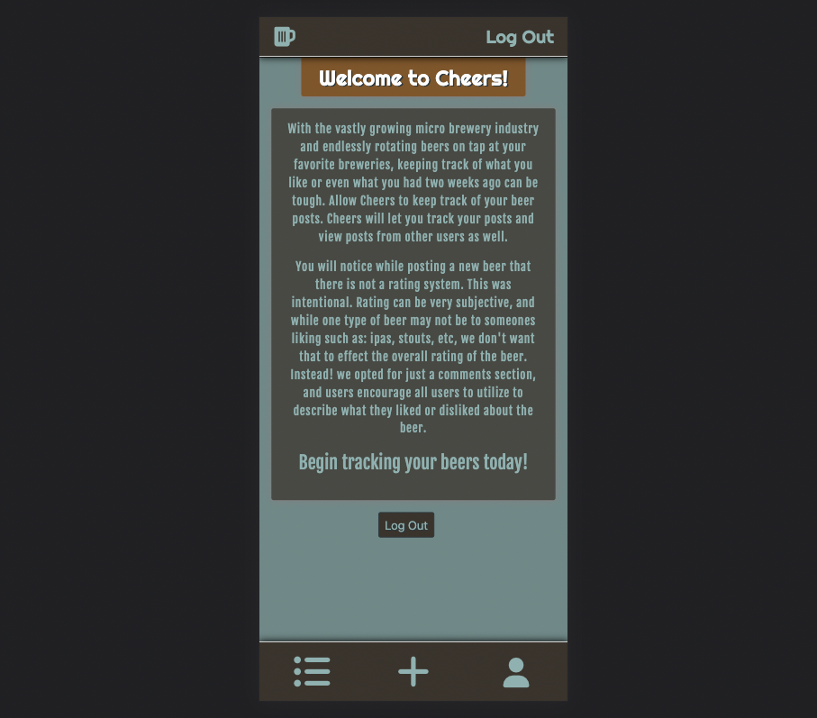
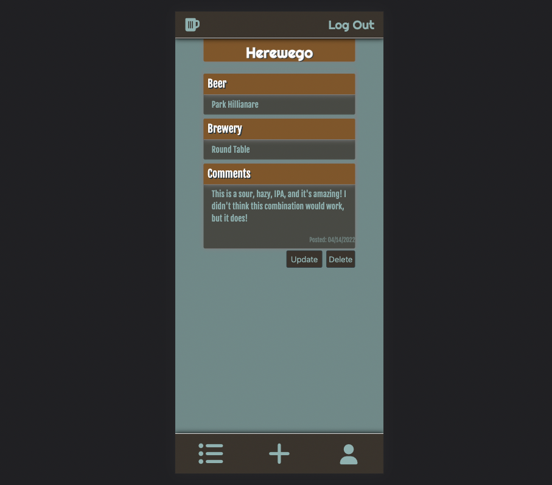

# Cheers

## Post Your Own Beer 

#### Click [here](https://ih-cheers.herokuapp.com/) to start!

 

---
---

## Motivation
 

With breweries endlessly opening and producing more and more different beers, I wanted to create a mobile app that allowed users to post beers they are drinking. While the idea was inspired by Untapped, I wanted to take what I have learned about Python, PostgreSQL, and Flask to create an app that friends and family (+21) could enjoy.
 
 

---
---
## Trello Planning

#### Click [here](https://trello.com/b/LTh1wrax/cheers) to view trello planning board.
 

---
---

## Screenshots

#### Landing Page:

 

#### Post Page:

 

---
---

## Technologies:

         

 
 
 ---
 ---

 ## Credits:
 

-Bootstrap - Card layout - https://getbootstrap.com/

-Font Awesome - Icons - https://fontawesome.com/

-Whimsical - Wireframe - https://whimsical.com/

-Trello - planning board - https://trello.com/
 

---
---

## Ice Box:
 

- AAU I want an option, while creating a post, to show if the brewery has food.
- AAU I want an option, while creating a post, to show if the brewery is dog friendly.
- AAU I want to be able to search posts by brewery, beer name, username, or city/state.
- AAU I want a fleshed-out rating system that allows users to rate the beer but not have an over all rating of every user's rating.
- AAU I want a "like" button for my beers or other user's beers.
- AAU I want to be able to interact with other users via messaging or commenting.
- AAU I want to see photos on the pages, and i want to be able to upload a photo with my post.

---

